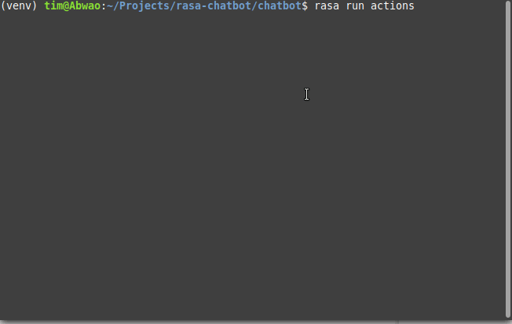

# Jokes, number & date trivia chatbot

A simple chatbot that's fun to talk to. Powered by [Rasa][1].

- Number and history facts courtesy of [Numbers API][2].
- Jokes courtesy of the [Official Jokes API][3].

## Prerequisites

- [Python][4] 3.6 or 3.7, and some knowledge of *Rasa* (check out [Rasa Basics][5]).
- An internet connection to fetch content from the APIs.

## Getting started

- Download the files, and create a virtual environment:

    ```bash
    git clone https://github.com/Tim-Abwao/rasa-chatbot.git
    cd rasa-chatbot
    # python3.6 or python3.7 required by Rasa
    python3.7 -m venv venv
    source venv/bin/activate
    ```

- Install the required packages:

    ```bash
    pip install -U pip
    pip install rasa rasa[spacy]
    python3.7 -m spacy download en_core_web_md
    python3.7 -m spacy link en_core_web_md en
    ```

- Train the chatbot:

    ```bash
    cd chatbot
    rasa train
    ```

- Start the action server:

    ```bash
    rasa run actions
    ```

    

- Open another terminal window (`ctrl` + `alt` + `N`) or tab (`ctrl` + `alt` + `T`), activate the virtual environment, and launch the command-line interface:

    ```bash
    source venv/bin/activate
    cd chatbot
    rasa shell
    ```

    

    (If you're curious about the warnings and errors that appear at the beginning, please have a look at [this question][6])

## Deployment Options

Please see [Messaging & Voice Channels](https://rasa.com/docs/rasa/user-guide/messaging-and-voice-channels/) for help on how to make the chatbot available on various platforms. Options include:

- Your own website
- Facebook Messenger
- Slack
- Telegram
- Twilio
- Microsoft Bot Framework
- Cisco Webex Teams
- RocketChat
- Mattermost
- Custom Connectors

That's all. Enjoy.

[1]: https://rasa.com
[2]: http://numbersapi.com
[3]: https://official-joke-api.appspot.com/random_joke
[4]: https://www.python.org
[5]: https://rasa.com/docs/rasa/user-guide/rasa-tutorial/
[6]: https://stackoverflow.com/questions/60368298/could-not-load-dynamic-library-libnvinfer-so-6
