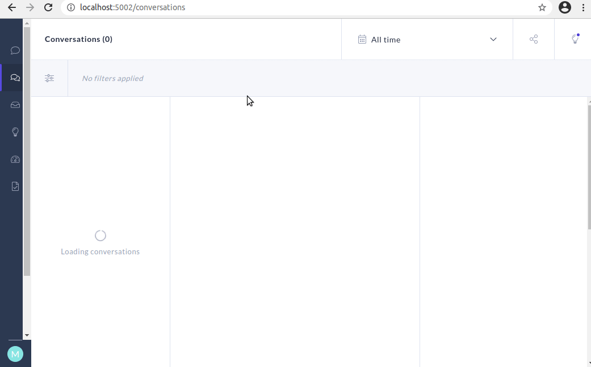

# Jokes & Trivia Chatbot

A simple chatbot that's fun to talk to. Powered by [Rasa][1].

- Number and history facts courtesy of [Numbers API][2].
- Jokes courtesy of the [Official Jokes API][3].

## Getting started

1. Download the necessary files:

    ```bash
    git clone https://github.com/Tim-Abwao/jokes-and-trivia-chatbot.git
    cd jokes-and-trivia-chatbot
    ```

2. Create a virtual environment, and install the required packages:

    ```bash
    python3 -m venv venv
    source venv/bin/activate
    pip3 install rasa-x --extra-index-url https://pypi.rasa.com/simple
    ```

3. Start [Rasa X][4] using the `run.sh` script:

    ```bash
    bash run.sh
    ```

    The script:

    - Activates the Python virtual environment (default *venv*).
    - Trains a model for the chatbot, if one doesn't yet exist.
    - Starts the *rasa action server*, and *rasa x server* - which additionally opens a browser tab to its user interface.

    Please visit the [rasa x user guide][4] to learn more about its features.

    

> **NOTE:** In case you encounter the error
>
> ... `from sqlalchemy.engine import reflection, RowProxy, Connection`
>
> `ImportError: cannot import name 'RowProxy' from 'sqlalchemy.engine'` ...
>
> consider installing a version of SQLAlchemy below 1.4.0 i.e.
>
> `pip install 'SQLAlchemy>=1.3.24, <1.4.0'`

## Deployment Options

Please see [Messaging & Voice Channels][5] for help on how to make the chatbot available on various platforms. Options include:

- Your own website
- Facebook Messenger
- Slack
- Telegram
- Twilio
- Microsoft Bot Framework
- Cisco Webex Teams
- RocketChat
- Mattermost
- Google Hangouts Chat
- Custom Connectors

[1]: https://rasa.com
[2]: http://numbersapi.com
[3]: https://official-joke-api.appspot.com/random_joke
[4]: https://rasa.com/docs/rasa-x/
[5]: https://rasa.com/docs/rasa/messaging-and-voice-channels/
