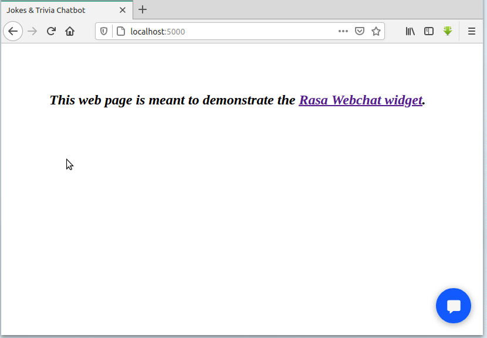
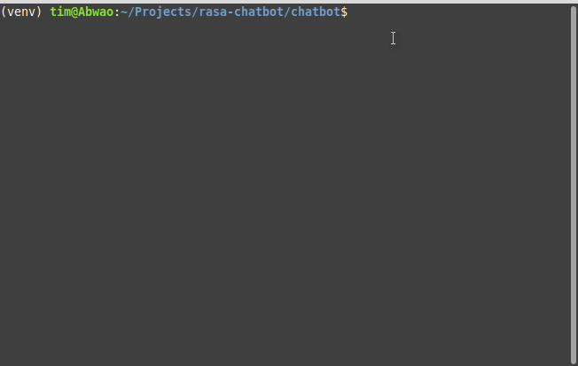

# Jokes, number & date trivia chatbot

A simple chatbot that's fun to talk to. Powered by [Rasa][1].

- Number and history facts courtesy of [Numbers API][2].
- Jokes courtesy of the [Official Jokes API][3].

## Prerequisites

- [Python][4] 3.6 or 3.7, and some knowledge of *Rasa* (check out [Rasa Basics][5]).
- An internet connection to fetch content from the APIs.

## Getting started

- Download the files, and create a virtual environment:

    ```bash
    git clone https://github.com/Tim-Abwao/rasa-chatbot.git
    cd rasa-chatbot
    # python3.6 or python3.7 required by Rasa
    python3.7 -m venv venv
    source venv/bin/activate
    ```

- Install the required packages:

    ```bash
    pip install -U pip
    pip install rasa rasa[spacy] Flask
    python3.7 -m spacy download en_core_web_md
    python3.7 -m spacy link en_core_web_md en
    ```

- Train the chatbot:

    ```bash
    cd chatbot
    rasa train
    ```

## Running the chatbot

### 1. Using the webchat widget

The [Rasa Webchat][7] widget (by [Botfront][8]) provides access to the chatbot from websites. The `run.sh` script in the `rasa-chatbot` directory sets up a [flask][9] web server & *Rasa* action server as background processes,  then runs the *Rasa* server:

```bash
cd ..
bash run.sh
```


Once you see the line *"Rasa server is up and running"*, head on to <localhost:5000> in your browser:



To terminate the *Rasa* server, enter `crtl` + `C` in the terminal it's running in.

### 2. The command-line interface

Use the following commands to run the *Rasa* action server (as a background process) and the *Rasa* command-line interface:

```bash
cd chatbot
# start action server as background process
rasa run actions &
action_server_pid=$!

# start command-line interface
rasa shell
```



*(If you're curious about the warnings and errors that appear at the beginning, please have a look at [this question][6])*

Then, once you stop the command-line interface (using `ctrl` + `C`), remember to terminate the background process (action server):

```bash
# stop action server on exit
kill $action_server_pid
```

## Deployment Options

Please see [Messaging & Voice Channels](https://rasa.com/docs/rasa/user-guide/messaging-and-voice-channels/) for help on how to make the chatbot available on various platforms. Options include:

- Your own website *(as in the Webchat demo above)*
- Facebook Messenger
- Slack
- Telegram
- Twilio
- Microsoft Bot Framework
- Cisco Webex Teams
- RocketChat
- Mattermost
- Custom Connectors

That's all. Enjoy.

[1]: https://rasa.com
[2]: http://numbersapi.com
[3]: https://official-joke-api.appspot.com/random_joke
[4]: https://www.python.org
[5]: https://rasa.com/docs/rasa/user-guide/rasa-tutorial/
[6]: https://stackoverflow.com/questions/60368298/could-not-load-dynamic-library-libnvinfer-so-6
[7]: https://github.com/botfront/rasa-webchat
[8]: https://botfront.io/
[9]: https://flask.palletsprojects.com/en/1.1.x/
